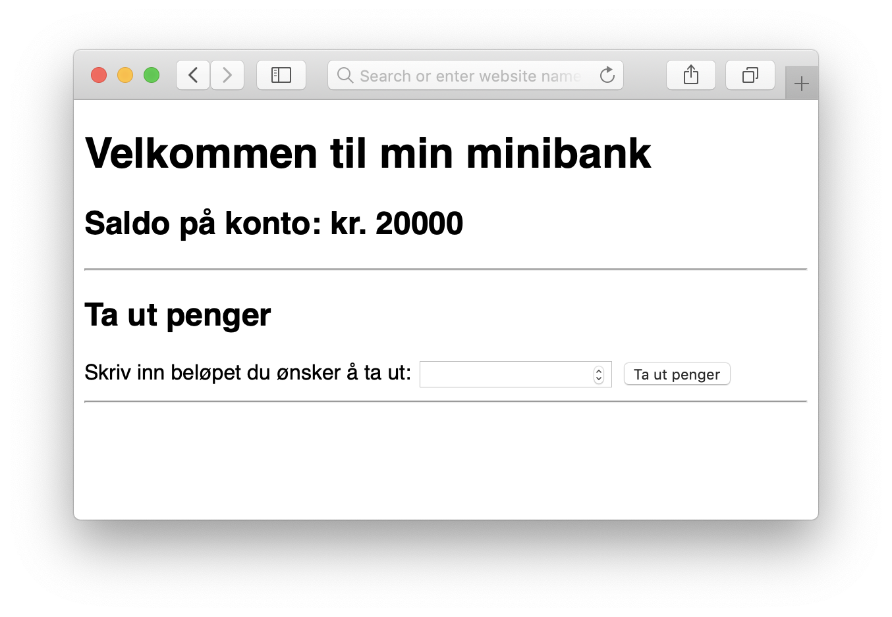

# Oppgave-tekst
En minibank er en installasjon hvor du stikker inn bank-kortet ditt, og velger et beløp som du vil ta ut av kontoen din og få utlevert av minibanken som kontanter. I denne oppgaven skal du kode logikken til minibanken. Du kan anta at du har en konto, og at denne kontoen i utgangspunktet har en saldo, altså så mye penger som du har på kontoen. Dette kan være definert i koden før programmet ditt kjører.

Når programmet starter, skal det vises hvor mye penger du har på kontoen, og det skal være mulig å ta ut penger ved å skrive inn ønsket beløp i et input-felt og for eksempel trykke på en knapp.

Når uttaket er gjennomført, skal det vises hvor mye du tok ut og hvor mye som står igjen på saldoen.

Hvis det ikke er nok penger på kontoen til å ta ut ønsket beløp, skal det vises en melding om dette og uttaket skal ikke gjennomføres.

## Innleveringsformat
Denne oppgaven skal løses i GitSpeak sammen med en annen medelev. Det vil si at en av dere leverer inn oppgaven via sin GitSpeak-konto, men dere skal samarbeide om løsningen. Når dere har løst oppgaven skal dere spille inn en liten GitSpeak screencast der dere forklarer koden deres for læreren.

Når dere har gjort opptaket trykker dere på "Stopp" og deretter "Lever til lærer". Søk opp navnet på læreren deres og velg vedkommende. Trykk på "Lever inn".

## Tilbakemeldingsformat
Læreren vil gi tilbakemelding skriftlig via GitSpeak-appen.

## Ekstra utfordringer

### Sette inn penger
Vår minibank er ikke som andre minibanker. Siden det er du som skriver koden til minibanken, kan du like gjerne la brukerne kunne sette inn penger også. Opprett en egen knapp, og eventuelt et nytt input-felt som sørger for at beløpet som skrives inn settes inn på kontoen. Når innskuddet er  gjort, skal det vises hvor stort innskuddet er og hvor mye som nå står på kontoen.

### Konto-utskrift
Siden minibanken din nå både kan brukes til å sette inn og ta ut penger, kan det være spennende å se de forskjellige transaksjonene som er gjort på kontoen din. Ta vare på data om alle transaksjoner som gjøres i minibanken i et array eller en annen kolleksjon. Etter en transaksjon skal du vise en konto-utskrift med alle transaksjonene. Markér gjerne med forskjellige farger om det er et uttak eller et innskudd.
